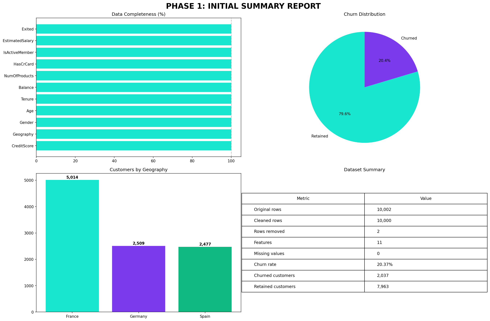
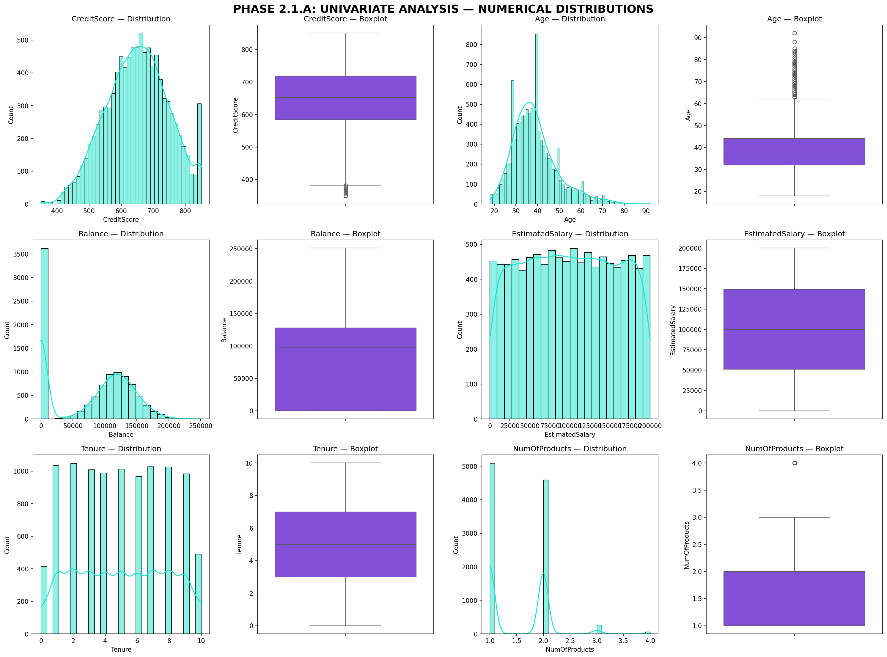
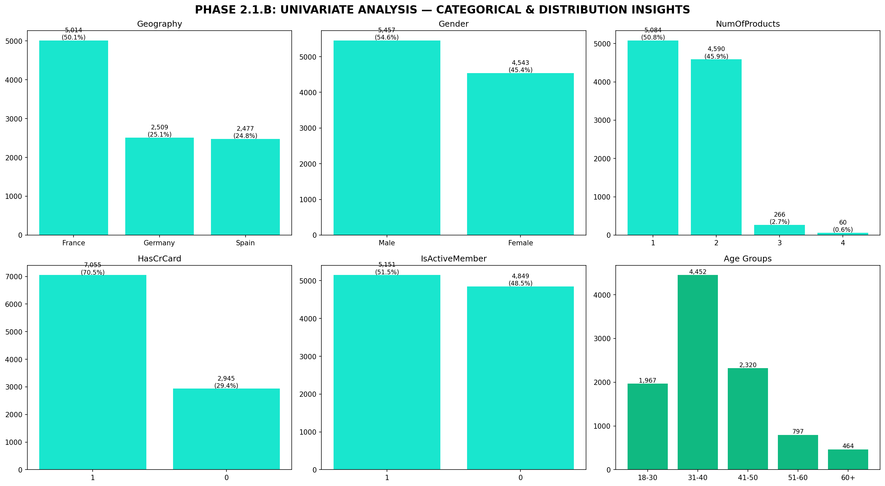
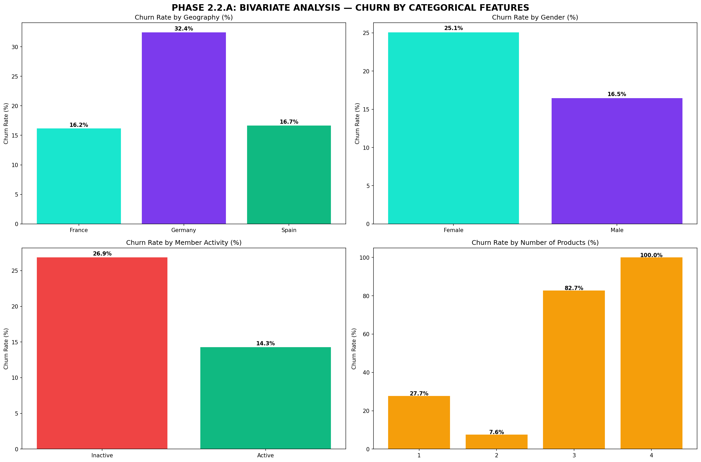
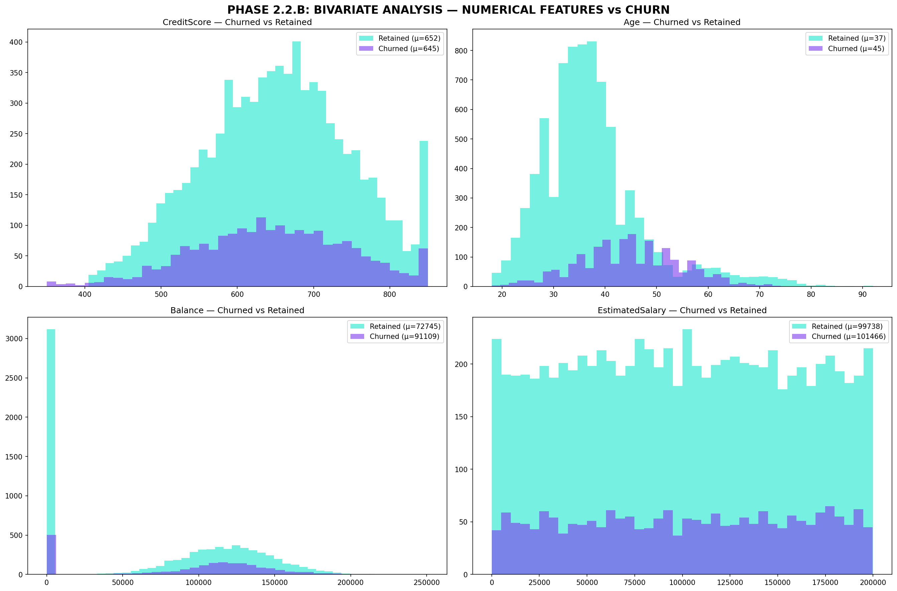
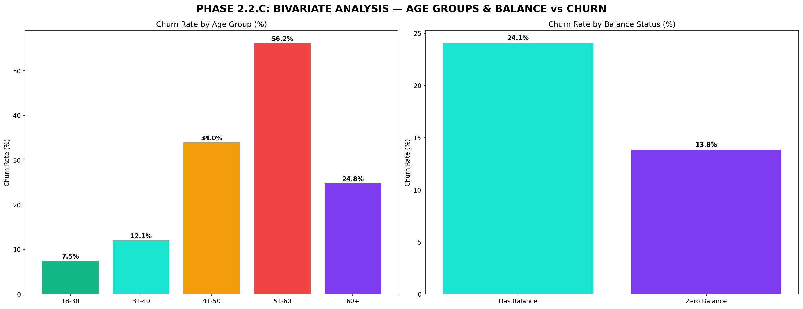
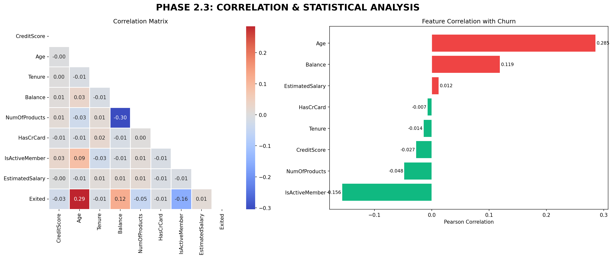

# 📊 Bank Customer Churn Analysis

**Author:** Humendra Pun  
**Date:** August 2025  
**Tools:** Python · Pandas · NumPy · Matplotlib · Seaborn · Scikit-learn

---

## Overview

End-to-end Python analysis identifying the key drivers of customer churn for a bank with 10,000 customers across France, Germany, and Spain. The project covers the full data science workflow — raw data ingestion, cleaning, EDA, and actionable business recommendations.

**Dataset:** 10,002 rows × 14 columns → cleaned to **10,000 rows × 11 features**  
**Target variable:** `Exited` (1 = churned, 0 = retained)

---

## Results at a Glance

| Metric | Value |
|--------|-------|
| Overall churn rate | **20.37%** (2,037 customers) |
| Highest churn by country | **Germany — 32.44%** |
| Highest churn by age group | **51–60 years — 56.21%** |
| Avg age of churned customers | **44.84** vs 37.41 (retained) |
| Dataset size after cleaning | **10,000 customers** |

---

## Project Structure

```
├── Bank Customer Churn Analysis.ipynb   # Full analysis notebook
├── Churn_Modelling.csv                  # Raw dataset
├── bank_churn_cleaned.csv               # Cleaned dataset (Phase 1 output)
└── README.md
```

---

## Phase 1: Data Understanding & Preparation 📁

### 🔍 1.1 Initial Data Exploration
- Load the dataset and check dimensions (rows × columns)
- Display first/last rows to understand structure
- Check data types of each column
- Understand what each column represents


---

### 📋 1.2 Data Quality Assessment
- Checked for missing values and their patterns
- Identified duplicates
- Validated data ranges (Age, CreditScore, Tenure, binary columns)

**Issues found:**
- 2 duplicate rows removed
- 4 columns had 1 missing value each → filled with mode/median
- Age had non-integer decimal values → corrected to integer
- CreditScore range valid: 350–850 ✅
- Tenure range valid: 0–10 years ✅


---

### 🧹 1.3 Data Cleaning

| Step | Action |
|------|--------|
| Duplicates | Removed 2 duplicate rows |
| Missing values | Filled Geography (mode: France), Age (median: 37), HasCrCard & IsActiveMember (mode: 1) |
| Column removal | Dropped RowNumber, CustomerId, Surname (3 irrelevant columns) |
| Data types | Converted HasCrCard, IsActiveMember, Age to integer |
| Outliers | Detected but retained — 15 in CreditScore (0.15%), 359 in Age (3.59%) |

**Final cleaned dataset: 10,000 rows × 11 columns — zero missing values**




---

## Phase 2: Exploratory Data Analysis (EDA) 📈

### 📊 2.1 Univariate Analysis





**Customer geography split:**
- France: 5,014 (50.14%) · Germany: 2,509 (25.09%) · Spain: 2,477 (24.77%)

**Age distribution:**
- 18–30: 19.7% · 31–40: 44.5% · 41–50: 23.2% · 51–60: 8.0% · 60+: 4.6%

**Balance:** 36.16% of customers have zero balance

**Target variable:**
- Retained: 7,963 (79.63%)
- Churned: 2,037 (**20.37%**)

---

### 🔗 2.2 Bivariate Analysis



#### Geography vs Churn

| Country | Customers | Churned | Churn Rate |
|---------|-----------|---------|------------|
| France | 5,014 | 810 | 16.15% |
| Germany | 2,509 | 814 | **32.44%** |
| Spain | 2,477 | 413 | 16.67% |

> Germany has double the churn rate of France and Spain despite having fewer customers.

---

#### Gender vs Churn
- Female customers churn at **25.1%** vs males at ~16%

---

#### Age Groups vs Churn

| Age Group | Customers | Churn Rate |
|-----------|-----------|------------|
| 18–30 | 1,967 | 7.52% |
| 31–40 | 4,452 | 12.08% |
| 41–50 | 2,320 | **33.97%** |
| 51–60 | 797 | **56.21%** |
| 60+ | 464 | 24.78% |

> Churn rate peaks in the 51–60 age group at 56.21%. Customers aged 41+ are the highest-risk segments.

---



#### Churned vs Retained — Mean Comparison

| Feature | Churned | Retained | Difference |
|---------|---------|----------|------------|
| Age | 44.84 | 37.41 | +7.43 (+19.9%) |
| CreditScore | 645.35 | 651.85 | -6.50 (-1.0%) |

> Age is a far stronger churn predictor than CreditScore.

---



#### Number of Products vs Churn
- 1 product: 50.84% of customer base — significantly higher churn
- 2 products: 45.90% — lower churn, highest retention
- 3–4 products: small segment but disproportionately high churn rates

---

### 🎯 2.3 Correlation Analysis



- **Age** — strongest positive correlation with churn
- **IsActiveMember** — negative correlation; inactive members churn more
- **NumOfProducts** — non-linear relationship with churn
- **CreditScore & EstimatedSalary** — minimal correlation with churn

---

## Key Findings

1. **Germany is a critical risk market** — 32.44% churn vs ~16% in France and Spain
2. **Middle-to-older customers (41–60) are the highest risk** — 51–60 age band peaks at 56.21%
3. **Female customers churn at 25.1%** vs ~16% for males
4. **Inactive members churn at 26.9%** vs active members — engagement directly reduces attrition
5. **CreditScore is a weak predictor** — only 6.5 point difference between churned and retained
6. **Customers with 3–4 products have extremely high churn** — despite being a small segment (3.26%)
7. **Zero-balance customers churn less** — customers with money in the account have higher stickiness
8. **Males churn at 16.5%** vs females at 25.1% — 8.6 percentage point gap

---

## Business Recommendations

| Priority | Recommendation |
|----------|---------------|
| 🔴 High | Targeted retention campaigns in Germany with localised, personalised offers |
| 🔴 High | Age-segmented loyalty programmes for customers aged 41–60 |
| 🟡 Medium | Gender-specific engagement strategies for female customer segments |
| 🟡 Medium | Cross-sell products to single-product customers to increase stickiness |
| 🟡 Medium | Review product bundling strategy — 3–4 product customers show disproportionate churn |
| 🟢 Low | Re-engagement campaigns for inactive members (26.9% churn rate) |

---

## Tech Stack

| Library | Purpose |
|---------|---------|
| `pandas` | Data loading, cleaning, manipulation |
| `numpy` | Numerical operations, outlier detection |
| `matplotlib` | Custom visualisations |
| `seaborn` | Statistical plots |
| `scikit-learn` | Pipeline ready for modelling phase |
